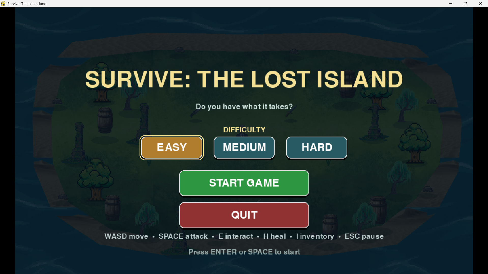
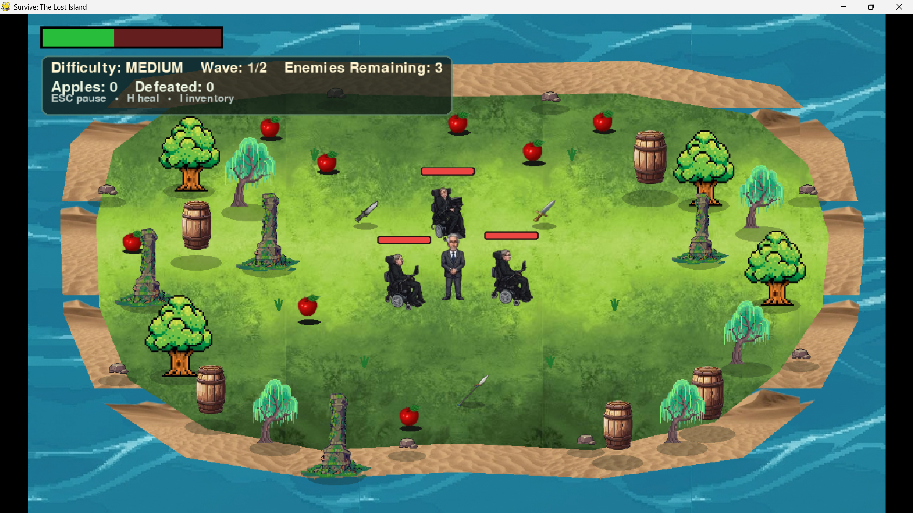
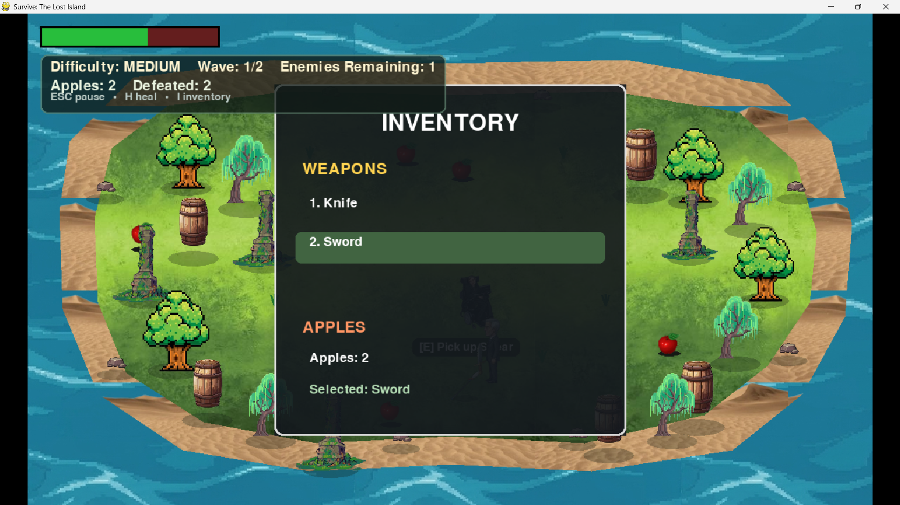
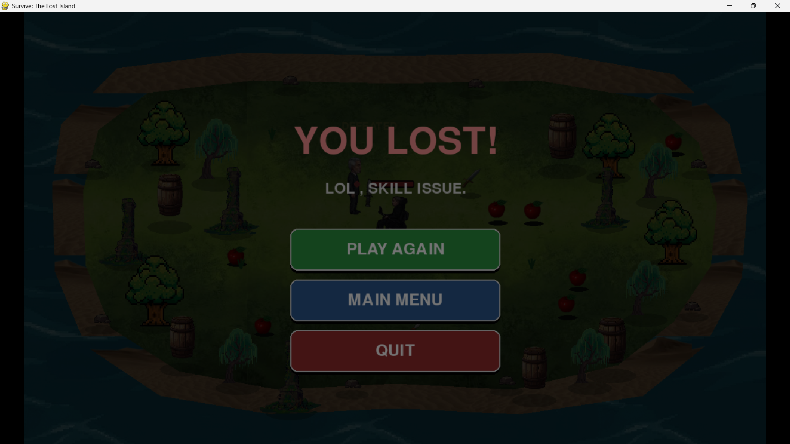

# 🏝️ Survive: The Lost Island

A top-down 2D survival combat game built with Python and Pygame. Fight off waves of enemies on a hand-shaped island, scavenge weapons and food, and survive until the last wave falls.

---

## Overview

**Survive: The Lost Island** drops the player on a small island rendered as a textured polygon (sand beach ring, grass interior). The player explores the island, picks up one of three melee weapons, fights AI-controlled enemies that spawn in waves, and manages health using apple pickups. The game is played entirely with mouse-free wave-based combat until all waves for the selected difficulty are cleared.

The project is a single self-contained Pygame script (`main code.py`) — no external engine, no build system, just Python and Pygame.

---

## Features

**Implemented**
- Directional sprite-sheet animation for the player and enemies (4 directions × 4 frames, extracted from a 4×4 grid sheet)
- Polygon-based island collision (`point_inside_island`) so the player and enemies can't walk into the ocean
- Real-time melee combat with directional hitboxes, per-weapon damage/range/cooldown, and a swing animation
- Three difficulty modes (Easy / Medium / Hard) with distinct wave counts and enemy counts per wave
- Enemy AI with three states: wandering, chasing (within detection range), and attacking (within attack range), plus enemy-vs-enemy collision avoidance
- Health system for both player and enemies, with a visible health bar over each enemy and a HUD health bar for the player
- Apple pickups that heal the player (consumed with a key press)
- Weapon pickups (Knife, Sword, Spear) with a floating bob animation and an on-screen pickup prompt
- Inventory system (up to 3 weapons + apple count) with a dedicated inventory panel UI
- Particle effects and floating combat text (damage numbers, "DEFEATED", "+1 APPLE", "+30 HP")
- Procedurally generated sound effects (via `array` + `math`) that are used automatically if `.wav` files aren't present in the `aset` folder — the game is fully playable with zero audio assets
- Main menu with difficulty selection, pause menu (Resume/Restart/Main Menu/Quit), and a win/lose game-over screen with Play Again / Main Menu / Quit
- Resizable window and fullscreen toggle (F11), with the game rendered internally at a fixed 1200×700 resolution and scaled/letterboxed to fit the actual window (mouse coordinates are correctly converted back to game space)
- Wave banner UI announcing each new wave
- Screen fade transitions on game start and game over
- Graceful asset fallback: any missing image loads as a flat colored placeholder rectangle instead of crashing
---

## Gameplay

The core loop:

1. Choose a difficulty in the main menu (or press `1`/`2`/`3`), then start the game.
2. Explore the island on foot, avoiding trees and rocks (solid obstacles).
3. Walk near a weapon on the ground and press **E** to pick it up (max 3 weapons carried at once).
4. Press **Space** to attack in the direction you're facing. Each weapon has its own damage, reach, and cooldown.
5. Enemies wander until you enter their detection range, then chase and attack you at close range.
6. Collect apples (**E** to pick up) and press **H** to consume one and heal, when your health isn't full.
7. Clear all enemies in a wave to advance to the next wave. Clear all waves for your difficulty to win.
8. If your health reaches 0, the run ends in defeat.

**Win condition:** defeat every enemy in every wave for the selected difficulty.
**Lose condition:** player health reaches 0.

**Weapons:**

| Weapon | Damage | Range | Cooldown | Swing Duration |
|--------|-------:|------:|---------:|----------------:|
| Knife  | 35     | 82    | 0.32s    | 0.18s |
| Sword  | 50     | 102   | 0.52s    | 0.24s |
| Spear  | 70     | 138   | 0.75s    | 0.30s |

**Enemies:** all enemies share the same stats — 100 HP, detection range 320px, attack range 78px, 10 damage per hit, 1-second attack cooldown. They wander randomly when the player is far away, chase when in detection range, and attack (with a brief cooldown between hits) once in range.

---

## Difficulty Modes

Difficulty is data-driven via a `DIFFICULTY_WAVES` table and selected from the main menu before starting:

| Difficulty | Waves | Enemies per Wave |
|-----------|:-----:|-------------------|
| Easy      | 1     | 3 |
| Medium    | 2     | 3 → 2 |
| Hard      | 3     | 3 → 3 → 4 |

Each wave spawns fresh enemies once the previous wave is fully cleared; a banner announces the new wave number and enemy count. Enemy spawn points are chosen randomly on valid island tiles (not overlapping obstacles, the player, or each other), with a deterministic fallback position list if random placement fails.

---

## Controls

| Key / Input | Action |
|---|---|
| `W` `A` `S` `D` | Move (up / left / down / right) |
| `Space` | Attack with currently selected weapon |
| `E` | Pick up nearby weapon or apple |
| `H` | Heal using one apple (if not at full health) |
| `I` | Open / close inventory |
| `1` `2` `3` | Select weapon slot 1 / 2 / 3 (in-game) |
| `1` `2` `3` | Select Easy / Medium / Hard (in main menu) |
| `Esc` | Pause / resume |
| `F11` | Toggle fullscreen |
| `Enter` / `Space` | Start game (from main menu) |
| Mouse click | Interact with menu, pause, and game-over buttons |

---

## Technologies Used

- **Python 3**
- **Pygame** — rendering, input, sound, window management
- Python standard library: `os`, `math`, `random`, `array` (used to synthesize fallback sound effects as raw PCM buffers)

No other third-party libraries are used.

---


## How to Run

**Requirements:**
- Python 3.8+
- Pygame

**Steps:**

1. Make sure Python 3 is installed:
   ```bash
   python --version
   ```
2. Install Pygame:
   ```bash
   pip install pygame
   ```
3. From the project folder (with the `aset/` directory alongside the script), run:
   ```bash
   python "main code.py"
   ```
4. The game window opens at 1200×700 (resizable). Use the main menu to pick a difficulty and press **Enter**/**Space** or click **START GAME**.

> The game will still launch and run without any files in `aset/` — missing images become colored placeholder blocks and missing sounds fall back to generated tones, so it's safe to test before adding final art/audio.

---

## Installation

No `requirements.txt` was confirmed to exist in this project. Based on the imports in the code, the only external dependency is:

```
pygame
```

To set up manually:

```bash
git clone <your-repo-url>
cd survive-the-lost-island
pip install -r requirements.txt
python "main code.py"
```

If you'd like, create a `requirements.txt` containing:
```
pygame
```

---

## Game Screenshots

### Main Menu


### Gameplay


### Inventory


### Game-Over



## Technical Highlights

- **Object-oriented design** — `Player`, `Enemy`, `Obstacle`, `Rock`, `WeaponPickup`, `ApplePickup`, `Weapon`, `Particle`, and `FloatingText` classes encapsulate their own state, update, and draw logic.
- **Delta-time based movement and animation** — all motion and timers use `dt` (clamped to a max of 0.05s to avoid physics spikes on lag/resize), making the game frame-rate independent.
- **Sprite sheet slicing** — player and enemy sheets are sliced into a 4×4 grid at load time and organized into per-direction animation frame lists.
- **Custom collision system** — axis-separated rectangle collision (resolve X, then Y independently) for obstacles, rocks, and enemy-vs-enemy blocking, plus a hand-rolled point-in-polygon test for the island boundary.
- **Directional hitbox combat** — attack hitboxes are generated dynamically based on the player's facing direction and the equipped weapon's range/size.
- **Basic enemy AI state machine** — wander → chase → attack, driven by distance checks against `DETECTION_RANGE` and `ATTACK_RANGE`.
- **Procedural audio synthesis** — sound effects are generated as raw PCM sine-wave buffers via the `array` module and fed directly to `pygame.mixer.Sound`, entirely without external audio files.
- **Resolution-independent rendering** — the game always draws to a fixed 1200×700 internal surface, then scales and letterboxes that surface to the real window size (including converting mouse coordinates back into game space).
- **Data-driven difficulty** — wave counts and enemy counts live in a single `DIFFICULTY_WAVES` dictionary rather than being hardcoded into game logic.
- **Procedural terrain texturing** — beach and grass textures are tiled across the screen and then masked to a polygon shape using `BLEND_RGBA_MULT`, generated once at startup rather than per frame.


## Credits / Assets

- Built with [Pygame](https://www.pygame.org/).
- Game art assets (character sprite sheets, weapons, environment tiles, terrain textures) are included in the `aset/` folder. No asset source/license information was provided with the project files — if these were sourced from third parties (asset packs, stock sites, AI generation, etc.), credit the original creators here and confirm you have the right to use and distribute them before publishing this repository publicly.

---

## Author

**Wali Chohan**
Computer Science student building software projects with Python and exploring game development, AI, and software engineering. This project demonstrates practical experience with Pygame, object-oriented programming, sprite animation, collision detection, enemy AI, combat systems, and UI design.


---
